# 阶梯架构图（S0 – S13）

每张图节点集合完全相同，**只有颜色变化**，所以把相邻两张并排看，橙色就是这一步新增的东西。

图是**分层带**：一个色块 = 一个模块，按 ui / core / services / 外部 四层排列；层内不画连线（连线与数据流见 `docs\架构总览.md` 的数据面图与 `docs\详细设计.md` 各步接口），这样相邻两张只差颜色，最容易对比。

| 颜色 | 含义 |
|---|---|
| 灰蓝实线 | 外部设备 / 客户端（一直存在） |
| 绿色实线 | 已完成（≤ 当前步） |
| 橙色粗线 | **本步新增** |
| 灰色虚线 | 未实现，后续步骤预留的挂点 |

## 两层结构：先做完整终端工具，再挂扩展

S1–S7 造出 `desktop.exe` 本体——一个原生 Win32 的完整终端工具（通道 / 终端 / 文件 / 按钮 / 托盘 / 日志），S7 结束时可以独立交付，且不监听任何端口。S8–S13 是挂在这个工具上的扩展，每项独立开关；全关掉，本体照常工作。

| 层 | 步骤 | 内容 |
|---|---|---|
| — | S0 | 工程地基 |
| 本体 | S1 | 配置 / 环形日志 / 串口桥 |
| 本体 | S2 | SSH 出站链路 |
| 本体 | S3 | 窗口壳 + 生命周期 |
| 本体 | S4 | 终端窗格 |
| 本体 | S5 | 通道管理 + 热应用 |
| 本体 | S6 | 界面偏好 / 会话操作 / 快捷键 |
| 本体 | S7 | 文件与脚本（本体出口） |
| 扩展 | S8 | SSH 入站网关 |
| 扩展 | S9 | HTTP 基元 + 网页端 |
| 扩展 | S10 | Agent 接口 |
| 扩展 | S11 | 继电器 / TFTP / NFS |
| 扩展 | S12 | TCP 转发 / 隧道 / 发现 |
| 扩展 | S13 | 自更新 / 打包 / 全量回归 |

> 本文件由 `scripts/gen_arch_mermaid.py` 生成，请改脚本里的 NODES / EDGES 后重跑，不要手改。

> 打印建议：默认每两页一组（如 S0+S1），便于同页对照；转 PDF 时用 `docs/pdf-print.css`，`
` 是不可见的分页标记。

## S0 工程地基

本步新增：**装配　｜　累计落地 1 / 27 个模块**

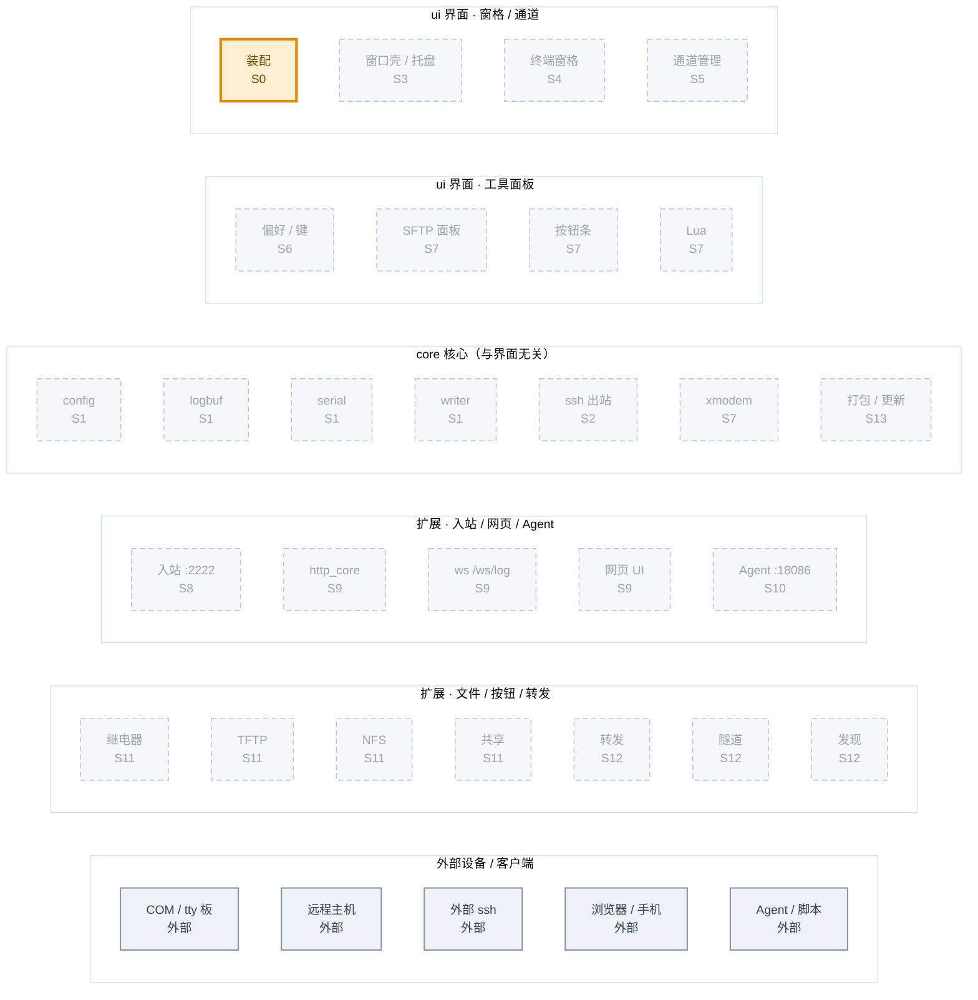
```mermaid
%%{init: {'theme':'base','themeVariables':{'clusterBkg':'#ffffff','clusterBorder':'#d7e1ec','fontFamily':'Microsoft YaHei, sans-serif','fontSize':'14px','lineColor':'#8794a3'},'flowchart':{'htmlLabels':false,'useMaxWidth':true}}}%%
flowchart LR
  classDef ext fill:#eef2f7,stroke:#8794a3,stroke-width:1.5px,color:#33414f
  classDef done fill:#e6f6ec,stroke:#2f9e63,stroke-width:2px,color:#14532d
  classDef cur fill:#fff0d2,stroke:#e08900,stroke-width:3px,color:#7a4400
  classDef plan fill:#f6f7f9,stroke:#b9c0c9,stroke-width:1px,color:#9aa4af,stroke-dasharray:6 4
  subgraph OUT["外部设备 / 客户端"]
    direction TB
    E_COM["COM / tty 板<br/>外部"]:::ext
    E_HOST["远程主机<br/>外部"]:::ext
    E_CLI["外部 ssh<br/>外部"]:::ext
    E_BR["浏览器 / 手机<br/>外部"]:::ext
    E_AG["Agent / 脚本<br/>外部"]:::ext
  end
  subgraph GSVC2["扩展 · 文件 / 按钮 / 转发"]
    direction TB
    REL["继电器<br/>S11"]:::plan
    TFTP["TFTP<br/>S11"]:::plan
    NFS["NFS<br/>S11"]:::plan
    SHR["共享<br/>S11"]:::plan
    FWD["转发<br/>S12"]:::plan
    TUN["隧道<br/>S12"]:::plan
    DSC["发现<br/>S12"]:::plan
  end
  subgraph GSVC1["扩展 · 入站 / 网页 / Agent"]
    direction TB
    INB["入站 :2222<br/>S8"]:::plan
    HTTP["http_core<br/>S9"]:::plan
    WS["ws /ws/log<br/>S9"]:::plan
    WEB["网页 UI<br/>S9"]:::plan
    AGT["Agent :18086<br/>S10"]:::plan
  end
  subgraph GCORE["core 核心（与界面无关）"]
    direction TB
    CFG["config<br/>S1"]:::plan
    LOGB["logbuf<br/>S1"]:::plan
    SER["serial<br/>S1"]:::plan
    WR["writer<br/>S1"]:::plan
    SSHOB["ssh 出站<br/>S2"]:::plan
    XMOD["xmodem<br/>S7"]:::plan
    UPD["打包 / 更新<br/>S13"]:::plan
  end
  subgraph GUI2["ui 界面 · 工具面板"]
    direction TB
    PREFS["偏好 / 键<br/>S6"]:::plan
    SFTP["SFTP 面板<br/>S7"]:::plan
    BTN["按钮条<br/>S7"]:::plan
    LUA["Lua<br/>S7"]:::plan
  end
  subgraph GUI1["ui 界面 · 窗格 / 通道"]
    direction TB
    APP["装配<br/>S0"]:::cur
    SHELL["窗口壳 / 托盘<br/>S3"]:::plan
    TERM["终端窗格<br/>S4"]:::plan
    MGMT["通道管理<br/>S5"]:::plan
  end
```

## S1 配置 / 环形日志 / 串口桥

本步新增：**config、logbuf、serial、writer　｜　累计落地 5 / 27 个模块**

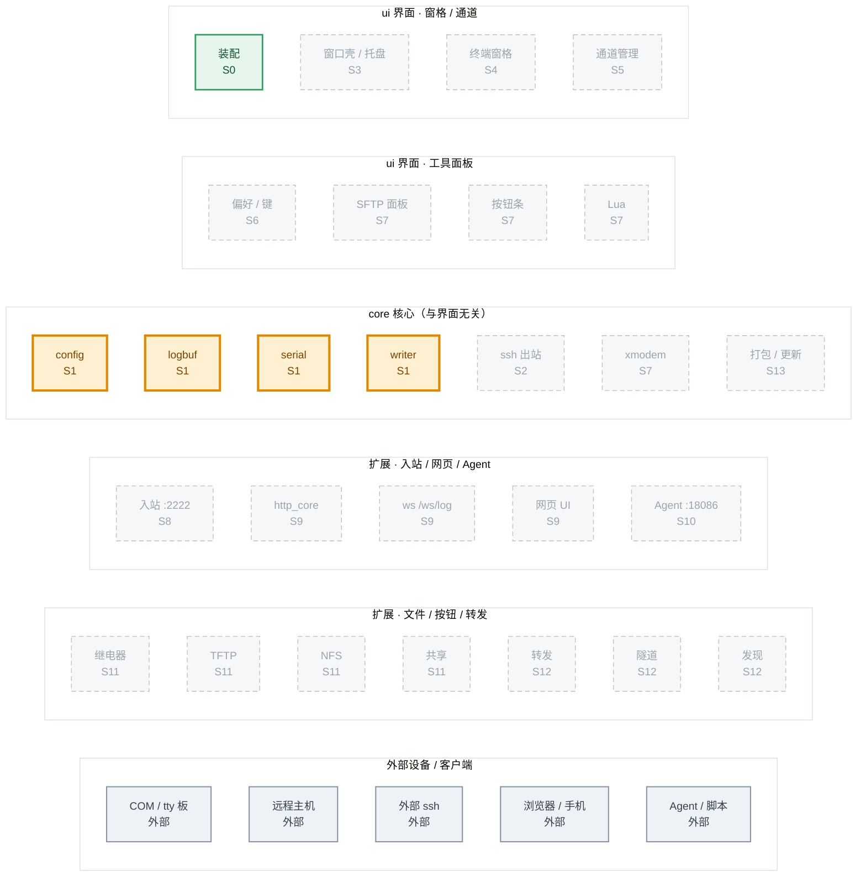
```mermaid
%%{init: {'theme':'base','themeVariables':{'clusterBkg':'#ffffff','clusterBorder':'#d7e1ec','fontFamily':'Microsoft YaHei, sans-serif','fontSize':'14px','lineColor':'#8794a3'},'flowchart':{'htmlLabels':false,'useMaxWidth':true}}}%%
flowchart LR
  classDef ext fill:#eef2f7,stroke:#8794a3,stroke-width:1.5px,color:#33414f
  classDef done fill:#e6f6ec,stroke:#2f9e63,stroke-width:2px,color:#14532d
  classDef cur fill:#fff0d2,stroke:#e08900,stroke-width:3px,color:#7a4400
  classDef plan fill:#f6f7f9,stroke:#b9c0c9,stroke-width:1px,color:#9aa4af,stroke-dasharray:6 4
  subgraph OUT["外部设备 / 客户端"]
    direction TB
    E_COM["COM / tty 板<br/>外部"]:::ext
    E_HOST["远程主机<br/>外部"]:::ext
    E_CLI["外部 ssh<br/>外部"]:::ext
    E_BR["浏览器 / 手机<br/>外部"]:::ext
    E_AG["Agent / 脚本<br/>外部"]:::ext
  end
  subgraph GSVC2["扩展 · 文件 / 按钮 / 转发"]
    direction TB
    REL["继电器<br/>S11"]:::plan
    TFTP["TFTP<br/>S11"]:::plan
    NFS["NFS<br/>S11"]:::plan
    SHR["共享<br/>S11"]:::plan
    FWD["转发<br/>S12"]:::plan
    TUN["隧道<br/>S12"]:::plan
    DSC["发现<br/>S12"]:::plan
  end
  subgraph GSVC1["扩展 · 入站 / 网页 / Agent"]
    direction TB
    INB["入站 :2222<br/>S8"]:::plan
    HTTP["http_core<br/>S9"]:::plan
    WS["ws /ws/log<br/>S9"]:::plan
    WEB["网页 UI<br/>S9"]:::plan
    AGT["Agent :18086<br/>S10"]:::plan
  end
  subgraph GCORE["core 核心（与界面无关）"]
    direction TB
    CFG["config<br/>S1"]:::cur
    LOGB["logbuf<br/>S1"]:::cur
    SER["serial<br/>S1"]:::cur
    WR["writer<br/>S1"]:::cur
    SSHOB["ssh 出站<br/>S2"]:::plan
    XMOD["xmodem<br/>S7"]:::plan
    UPD["打包 / 更新<br/>S13"]:::plan
  end
  subgraph GUI2["ui 界面 · 工具面板"]
    direction TB
    PREFS["偏好 / 键<br/>S6"]:::plan
    SFTP["SFTP 面板<br/>S7"]:::plan
    BTN["按钮条<br/>S7"]:::plan
    LUA["Lua<br/>S7"]:::plan
  end
  subgraph GUI1["ui 界面 · 窗格 / 通道"]
    direction TB
    APP["装配<br/>S0"]:::done
    SHELL["窗口壳 / 托盘<br/>S3"]:::plan
    TERM["终端窗格<br/>S4"]:::plan
    MGMT["通道管理<br/>S5"]:::plan
  end
```

## S2 SSH 出站链路

本步新增：**ssh 出站　｜　累计落地 6 / 27 个模块**

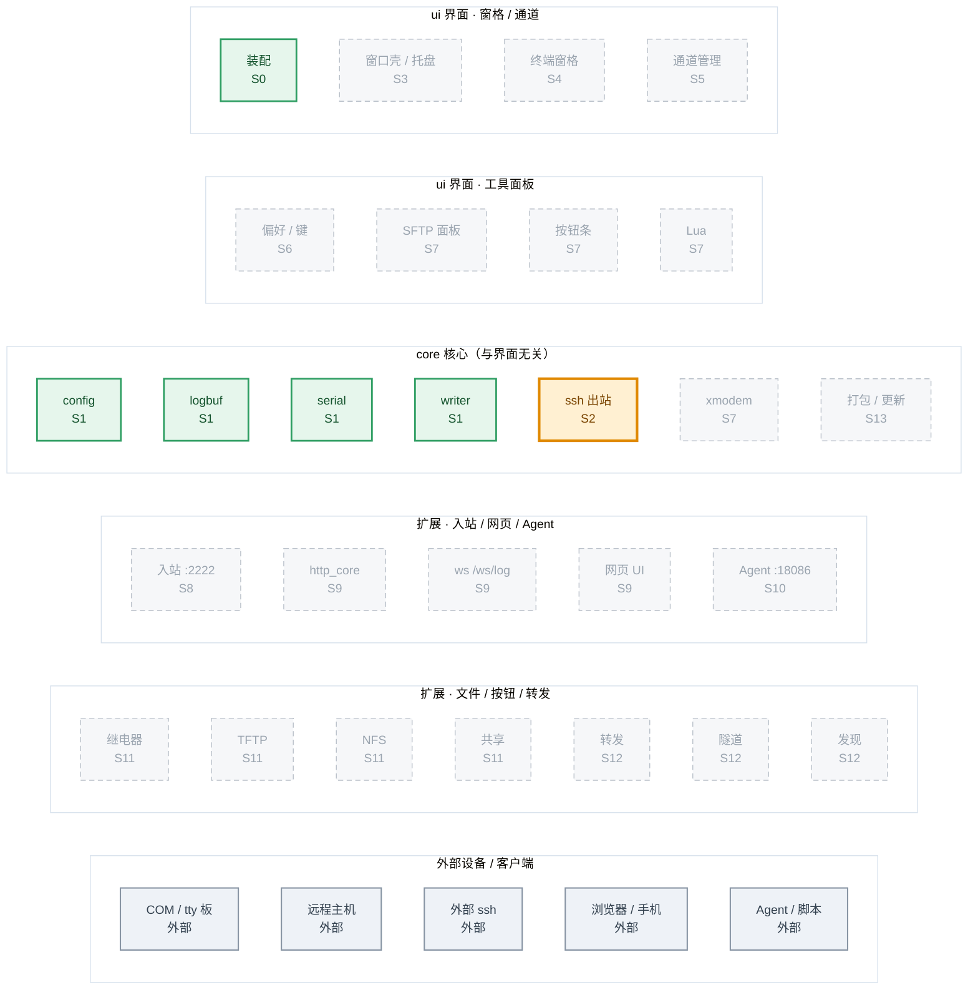
```mermaid
%%{init: {'theme':'base','themeVariables':{'clusterBkg':'#ffffff','clusterBorder':'#d7e1ec','fontFamily':'Microsoft YaHei, sans-serif','fontSize':'14px','lineColor':'#8794a3'},'flowchart':{'htmlLabels':false,'useMaxWidth':true}}}%%
flowchart LR
  classDef ext fill:#eef2f7,stroke:#8794a3,stroke-width:1.5px,color:#33414f
  classDef done fill:#e6f6ec,stroke:#2f9e63,stroke-width:2px,color:#14532d
  classDef cur fill:#fff0d2,stroke:#e08900,stroke-width:3px,color:#7a4400
  classDef plan fill:#f6f7f9,stroke:#b9c0c9,stroke-width:1px,color:#9aa4af,stroke-dasharray:6 4
  subgraph OUT["外部设备 / 客户端"]
    direction TB
    E_COM["COM / tty 板<br/>外部"]:::ext
    E_HOST["远程主机<br/>外部"]:::ext
    E_CLI["外部 ssh<br/>外部"]:::ext
    E_BR["浏览器 / 手机<br/>外部"]:::ext
    E_AG["Agent / 脚本<br/>外部"]:::ext
  end
  subgraph GSVC2["扩展 · 文件 / 按钮 / 转发"]
    direction TB
    REL["继电器<br/>S11"]:::plan
    TFTP["TFTP<br/>S11"]:::plan
    NFS["NFS<br/>S11"]:::plan
    SHR["共享<br/>S11"]:::plan
    FWD["转发<br/>S12"]:::plan
    TUN["隧道<br/>S12"]:::plan
    DSC["发现<br/>S12"]:::plan
  end
  subgraph GSVC1["扩展 · 入站 / 网页 / Agent"]
    direction TB
    INB["入站 :2222<br/>S8"]:::plan
    HTTP["http_core<br/>S9"]:::plan
    WS["ws /ws/log<br/>S9"]:::plan
    WEB["网页 UI<br/>S9"]:::plan
    AGT["Agent :18086<br/>S10"]:::plan
  end
  subgraph GCORE["core 核心（与界面无关）"]
    direction TB
    CFG["config<br/>S1"]:::done
    LOGB["logbuf<br/>S1"]:::done
    SER["serial<br/>S1"]:::done
    WR["writer<br/>S1"]:::done
    SSHOB["ssh 出站<br/>S2"]:::cur
    XMOD["xmodem<br/>S7"]:::plan
    UPD["打包 / 更新<br/>S13"]:::plan
  end
  subgraph GUI2["ui 界面 · 工具面板"]
    direction TB
    PREFS["偏好 / 键<br/>S6"]:::plan
    SFTP["SFTP 面板<br/>S7"]:::plan
    BTN["按钮条<br/>S7"]:::plan
    LUA["Lua<br/>S7"]:::plan
  end
  subgraph GUI1["ui 界面 · 窗格 / 通道"]
    direction TB
    APP["装配<br/>S0"]:::done
    SHELL["窗口壳 / 托盘<br/>S3"]:::plan
    TERM["终端窗格<br/>S4"]:::plan
    MGMT["通道管理<br/>S5"]:::plan
  end
```

## S3 窗口壳 + 生命周期

本步新增：**窗口壳 / 托盘　｜　累计落地 7 / 27 个模块**

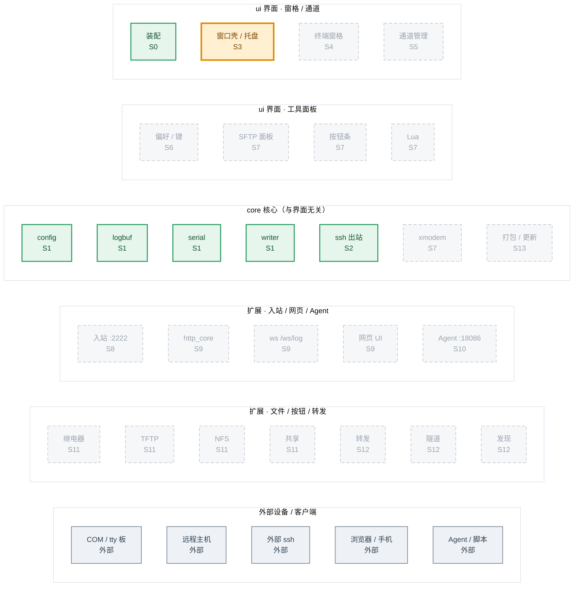
```mermaid
%%{init: {'theme':'base','themeVariables':{'clusterBkg':'#ffffff','clusterBorder':'#d7e1ec','fontFamily':'Microsoft YaHei, sans-serif','fontSize':'14px','lineColor':'#8794a3'},'flowchart':{'htmlLabels':false,'useMaxWidth':true}}}%%
flowchart LR
  classDef ext fill:#eef2f7,stroke:#8794a3,stroke-width:1.5px,color:#33414f
  classDef done fill:#e6f6ec,stroke:#2f9e63,stroke-width:2px,color:#14532d
  classDef cur fill:#fff0d2,stroke:#e08900,stroke-width:3px,color:#7a4400
  classDef plan fill:#f6f7f9,stroke:#b9c0c9,stroke-width:1px,color:#9aa4af,stroke-dasharray:6 4
  subgraph OUT["外部设备 / 客户端"]
    direction TB
    E_COM["COM / tty 板<br/>外部"]:::ext
    E_HOST["远程主机<br/>外部"]:::ext
    E_CLI["外部 ssh<br/>外部"]:::ext
    E_BR["浏览器 / 手机<br/>外部"]:::ext
    E_AG["Agent / 脚本<br/>外部"]:::ext
  end
  subgraph GSVC2["扩展 · 文件 / 按钮 / 转发"]
    direction TB
    REL["继电器<br/>S11"]:::plan
    TFTP["TFTP<br/>S11"]:::plan
    NFS["NFS<br/>S11"]:::plan
    SHR["共享<br/>S11"]:::plan
    FWD["转发<br/>S12"]:::plan
    TUN["隧道<br/>S12"]:::plan
    DSC["发现<br/>S12"]:::plan
  end
  subgraph GSVC1["扩展 · 入站 / 网页 / Agent"]
    direction TB
    INB["入站 :2222<br/>S8"]:::plan
    HTTP["http_core<br/>S9"]:::plan
    WS["ws /ws/log<br/>S9"]:::plan
    WEB["网页 UI<br/>S9"]:::plan
    AGT["Agent :18086<br/>S10"]:::plan
  end
  subgraph GCORE["core 核心（与界面无关）"]
    direction TB
    CFG["config<br/>S1"]:::done
    LOGB["logbuf<br/>S1"]:::done
    SER["serial<br/>S1"]:::done
    WR["writer<br/>S1"]:::done
    SSHOB["ssh 出站<br/>S2"]:::done
    XMOD["xmodem<br/>S7"]:::plan
    UPD["打包 / 更新<br/>S13"]:::plan
  end
  subgraph GUI2["ui 界面 · 工具面板"]
    direction TB
    PREFS["偏好 / 键<br/>S6"]:::plan
    SFTP["SFTP 面板<br/>S7"]:::plan
    BTN["按钮条<br/>S7"]:::plan
    LUA["Lua<br/>S7"]:::plan
  end
  subgraph GUI1["ui 界面 · 窗格 / 通道"]
    direction TB
    APP["装配<br/>S0"]:::done
    SHELL["窗口壳 / 托盘<br/>S3"]:::cur
    TERM["终端窗格<br/>S4"]:::plan
    MGMT["通道管理<br/>S5"]:::plan
  end
```

## S4 终端窗格

本步新增：**终端窗格　｜　累计落地 8 / 27 个模块**

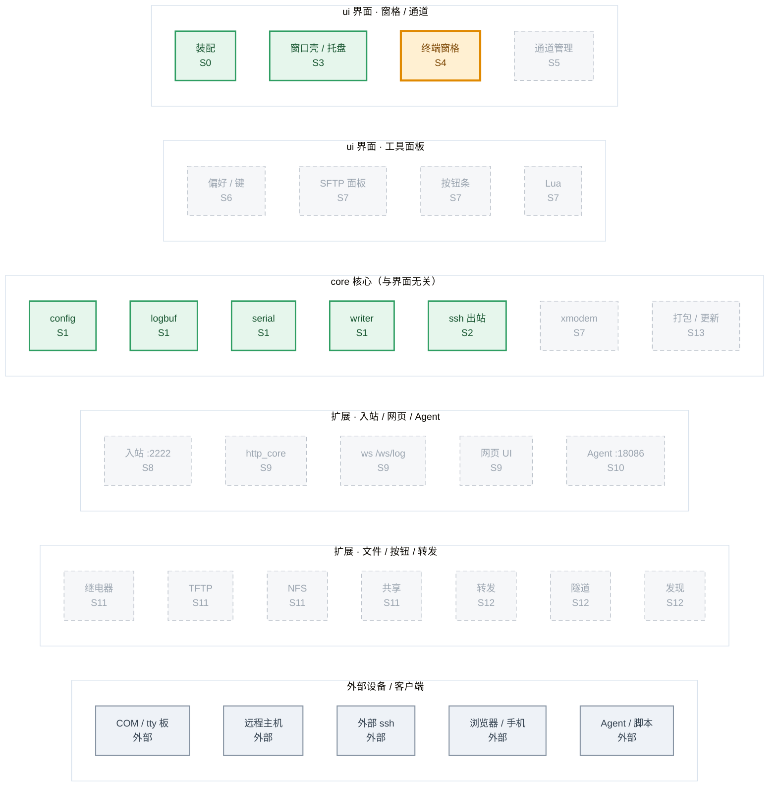
```mermaid
%%{init: {'theme':'base','themeVariables':{'clusterBkg':'#ffffff','clusterBorder':'#d7e1ec','fontFamily':'Microsoft YaHei, sans-serif','fontSize':'14px','lineColor':'#8794a3'},'flowchart':{'htmlLabels':false,'useMaxWidth':true}}}%%
flowchart LR
  classDef ext fill:#eef2f7,stroke:#8794a3,stroke-width:1.5px,color:#33414f
  classDef done fill:#e6f6ec,stroke:#2f9e63,stroke-width:2px,color:#14532d
  classDef cur fill:#fff0d2,stroke:#e08900,stroke-width:3px,color:#7a4400
  classDef plan fill:#f6f7f9,stroke:#b9c0c9,stroke-width:1px,color:#9aa4af,stroke-dasharray:6 4
  subgraph OUT["外部设备 / 客户端"]
    direction TB
    E_COM["COM / tty 板<br/>外部"]:::ext
    E_HOST["远程主机<br/>外部"]:::ext
    E_CLI["外部 ssh<br/>外部"]:::ext
    E_BR["浏览器 / 手机<br/>外部"]:::ext
    E_AG["Agent / 脚本<br/>外部"]:::ext
  end
  subgraph GSVC2["扩展 · 文件 / 按钮 / 转发"]
    direction TB
    REL["继电器<br/>S11"]:::plan
    TFTP["TFTP<br/>S11"]:::plan
    NFS["NFS<br/>S11"]:::plan
    SHR["共享<br/>S11"]:::plan
    FWD["转发<br/>S12"]:::plan
    TUN["隧道<br/>S12"]:::plan
    DSC["发现<br/>S12"]:::plan
  end
  subgraph GSVC1["扩展 · 入站 / 网页 / Agent"]
    direction TB
    INB["入站 :2222<br/>S8"]:::plan
    HTTP["http_core<br/>S9"]:::plan
    WS["ws /ws/log<br/>S9"]:::plan
    WEB["网页 UI<br/>S9"]:::plan
    AGT["Agent :18086<br/>S10"]:::plan
  end
  subgraph GCORE["core 核心（与界面无关）"]
    direction TB
    CFG["config<br/>S1"]:::done
    LOGB["logbuf<br/>S1"]:::done
    SER["serial<br/>S1"]:::done
    WR["writer<br/>S1"]:::done
    SSHOB["ssh 出站<br/>S2"]:::done
    XMOD["xmodem<br/>S7"]:::plan
    UPD["打包 / 更新<br/>S13"]:::plan
  end
  subgraph GUI2["ui 界面 · 工具面板"]
    direction TB
    PREFS["偏好 / 键<br/>S6"]:::plan
    SFTP["SFTP 面板<br/>S7"]:::plan
    BTN["按钮条<br/>S7"]:::plan
    LUA["Lua<br/>S7"]:::plan
  end
  subgraph GUI1["ui 界面 · 窗格 / 通道"]
    direction TB
    APP["装配<br/>S0"]:::done
    SHELL["窗口壳 / 托盘<br/>S3"]:::done
    TERM["终端窗格<br/>S4"]:::cur
    MGMT["通道管理<br/>S5"]:::plan
  end
```

## S5 通道管理 + 热应用

本步新增：**通道管理　｜　累计落地 9 / 27 个模块**

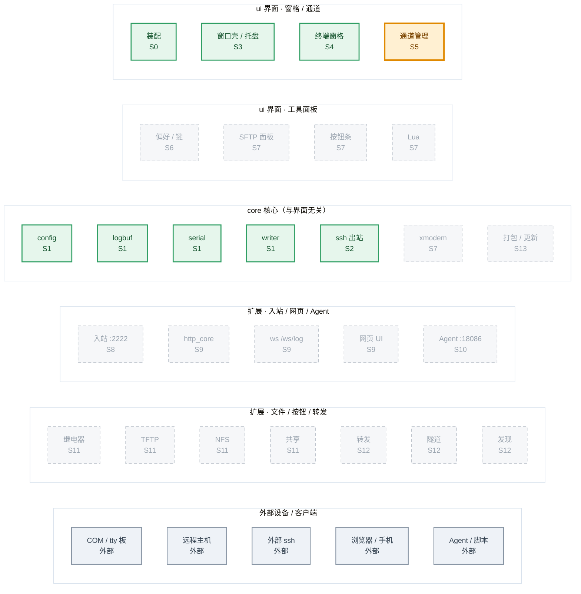
```mermaid
%%{init: {'theme':'base','themeVariables':{'clusterBkg':'#ffffff','clusterBorder':'#d7e1ec','fontFamily':'Microsoft YaHei, sans-serif','fontSize':'14px','lineColor':'#8794a3'},'flowchart':{'htmlLabels':false,'useMaxWidth':true}}}%%
flowchart LR
  classDef ext fill:#eef2f7,stroke:#8794a3,stroke-width:1.5px,color:#33414f
  classDef done fill:#e6f6ec,stroke:#2f9e63,stroke-width:2px,color:#14532d
  classDef cur fill:#fff0d2,stroke:#e08900,stroke-width:3px,color:#7a4400
  classDef plan fill:#f6f7f9,stroke:#b9c0c9,stroke-width:1px,color:#9aa4af,stroke-dasharray:6 4
  subgraph OUT["外部设备 / 客户端"]
    direction TB
    E_COM["COM / tty 板<br/>外部"]:::ext
    E_HOST["远程主机<br/>外部"]:::ext
    E_CLI["外部 ssh<br/>外部"]:::ext
    E_BR["浏览器 / 手机<br/>外部"]:::ext
    E_AG["Agent / 脚本<br/>外部"]:::ext
  end
  subgraph GSVC2["扩展 · 文件 / 按钮 / 转发"]
    direction TB
    REL["继电器<br/>S11"]:::plan
    TFTP["TFTP<br/>S11"]:::plan
    NFS["NFS<br/>S11"]:::plan
    SHR["共享<br/>S11"]:::plan
    FWD["转发<br/>S12"]:::plan
    TUN["隧道<br/>S12"]:::plan
    DSC["发现<br/>S12"]:::plan
  end
  subgraph GSVC1["扩展 · 入站 / 网页 / Agent"]
    direction TB
    INB["入站 :2222<br/>S8"]:::plan
    HTTP["http_core<br/>S9"]:::plan
    WS["ws /ws/log<br/>S9"]:::plan
    WEB["网页 UI<br/>S9"]:::plan
    AGT["Agent :18086<br/>S10"]:::plan
  end
  subgraph GCORE["core 核心（与界面无关）"]
    direction TB
    CFG["config<br/>S1"]:::done
    LOGB["logbuf<br/>S1"]:::done
    SER["serial<br/>S1"]:::done
    WR["writer<br/>S1"]:::done
    SSHOB["ssh 出站<br/>S2"]:::done
    XMOD["xmodem<br/>S7"]:::plan
    UPD["打包 / 更新<br/>S13"]:::plan
  end
  subgraph GUI2["ui 界面 · 工具面板"]
    direction TB
    PREFS["偏好 / 键<br/>S6"]:::plan
    SFTP["SFTP 面板<br/>S7"]:::plan
    BTN["按钮条<br/>S7"]:::plan
    LUA["Lua<br/>S7"]:::plan
  end
  subgraph GUI1["ui 界面 · 窗格 / 通道"]
    direction TB
    APP["装配<br/>S0"]:::done
    SHELL["窗口壳 / 托盘<br/>S3"]:::done
    TERM["终端窗格<br/>S4"]:::done
    MGMT["通道管理<br/>S5"]:::cur
  end
```

## S6 界面偏好 / 会话操作 / 快捷键

本步新增：**偏好 / 键　｜　累计落地 10 / 27 个模块**

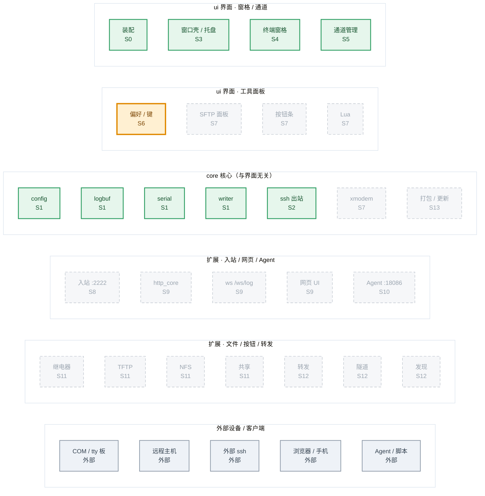
```mermaid
%%{init: {'theme':'base','themeVariables':{'clusterBkg':'#ffffff','clusterBorder':'#d7e1ec','fontFamily':'Microsoft YaHei, sans-serif','fontSize':'14px','lineColor':'#8794a3'},'flowchart':{'htmlLabels':false,'useMaxWidth':true}}}%%
flowchart LR
  classDef ext fill:#eef2f7,stroke:#8794a3,stroke-width:1.5px,color:#33414f
  classDef done fill:#e6f6ec,stroke:#2f9e63,stroke-width:2px,color:#14532d
  classDef cur fill:#fff0d2,stroke:#e08900,stroke-width:3px,color:#7a4400
  classDef plan fill:#f6f7f9,stroke:#b9c0c9,stroke-width:1px,color:#9aa4af,stroke-dasharray:6 4
  subgraph OUT["外部设备 / 客户端"]
    direction TB
    E_COM["COM / tty 板<br/>外部"]:::ext
    E_HOST["远程主机<br/>外部"]:::ext
    E_CLI["外部 ssh<br/>外部"]:::ext
    E_BR["浏览器 / 手机<br/>外部"]:::ext
    E_AG["Agent / 脚本<br/>外部"]:::ext
  end
  subgraph GSVC2["扩展 · 文件 / 按钮 / 转发"]
    direction TB
    REL["继电器<br/>S11"]:::plan
    TFTP["TFTP<br/>S11"]:::plan
    NFS["NFS<br/>S11"]:::plan
    SHR["共享<br/>S11"]:::plan
    FWD["转发<br/>S12"]:::plan
    TUN["隧道<br/>S12"]:::plan
    DSC["发现<br/>S12"]:::plan
  end
  subgraph GSVC1["扩展 · 入站 / 网页 / Agent"]
    direction TB
    INB["入站 :2222<br/>S8"]:::plan
    HTTP["http_core<br/>S9"]:::plan
    WS["ws /ws/log<br/>S9"]:::plan
    WEB["网页 UI<br/>S9"]:::plan
    AGT["Agent :18086<br/>S10"]:::plan
  end
  subgraph GCORE["core 核心（与界面无关）"]
    direction TB
    CFG["config<br/>S1"]:::done
    LOGB["logbuf<br/>S1"]:::done
    SER["serial<br/>S1"]:::done
    WR["writer<br/>S1"]:::done
    SSHOB["ssh 出站<br/>S2"]:::done
    XMOD["xmodem<br/>S7"]:::plan
    UPD["打包 / 更新<br/>S13"]:::plan
  end
  subgraph GUI2["ui 界面 · 工具面板"]
    direction TB
    PREFS["偏好 / 键<br/>S6"]:::cur
    SFTP["SFTP 面板<br/>S7"]:::plan
    BTN["按钮条<br/>S7"]:::plan
    LUA["Lua<br/>S7"]:::plan
  end
  subgraph GUI1["ui 界面 · 窗格 / 通道"]
    direction TB
    APP["装配<br/>S0"]:::done
    SHELL["窗口壳 / 托盘<br/>S3"]:::done
    TERM["终端窗格<br/>S4"]:::done
    MGMT["通道管理<br/>S5"]:::done
  end
```

## S7 文件与脚本（本体出口）

本步新增：**SFTP 面板、按钮条、Lua、xmodem　｜　累计落地 14 / 27 个模块**

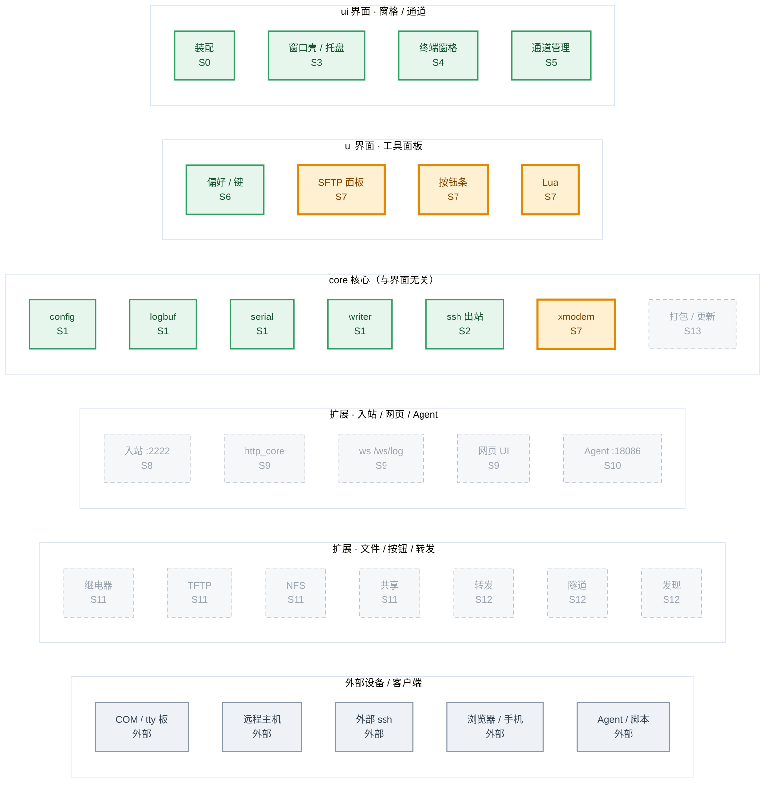
```mermaid
%%{init: {'theme':'base','themeVariables':{'clusterBkg':'#ffffff','clusterBorder':'#d7e1ec','fontFamily':'Microsoft YaHei, sans-serif','fontSize':'14px','lineColor':'#8794a3'},'flowchart':{'htmlLabels':false,'useMaxWidth':true}}}%%
flowchart LR
  classDef ext fill:#eef2f7,stroke:#8794a3,stroke-width:1.5px,color:#33414f
  classDef done fill:#e6f6ec,stroke:#2f9e63,stroke-width:2px,color:#14532d
  classDef cur fill:#fff0d2,stroke:#e08900,stroke-width:3px,color:#7a4400
  classDef plan fill:#f6f7f9,stroke:#b9c0c9,stroke-width:1px,color:#9aa4af,stroke-dasharray:6 4
  subgraph OUT["外部设备 / 客户端"]
    direction TB
    E_COM["COM / tty 板<br/>外部"]:::ext
    E_HOST["远程主机<br/>外部"]:::ext
    E_CLI["外部 ssh<br/>外部"]:::ext
    E_BR["浏览器 / 手机<br/>外部"]:::ext
    E_AG["Agent / 脚本<br/>外部"]:::ext
  end
  subgraph GSVC2["扩展 · 文件 / 按钮 / 转发"]
    direction TB
    REL["继电器<br/>S11"]:::plan
    TFTP["TFTP<br/>S11"]:::plan
    NFS["NFS<br/>S11"]:::plan
    SHR["共享<br/>S11"]:::plan
    FWD["转发<br/>S12"]:::plan
    TUN["隧道<br/>S12"]:::plan
    DSC["发现<br/>S12"]:::plan
  end
  subgraph GSVC1["扩展 · 入站 / 网页 / Agent"]
    direction TB
    INB["入站 :2222<br/>S8"]:::plan
    HTTP["http_core<br/>S9"]:::plan
    WS["ws /ws/log<br/>S9"]:::plan
    WEB["网页 UI<br/>S9"]:::plan
    AGT["Agent :18086<br/>S10"]:::plan
  end
  subgraph GCORE["core 核心（与界面无关）"]
    direction TB
    CFG["config<br/>S1"]:::done
    LOGB["logbuf<br/>S1"]:::done
    SER["serial<br/>S1"]:::done
    WR["writer<br/>S1"]:::done
    SSHOB["ssh 出站<br/>S2"]:::done
    XMOD["xmodem<br/>S7"]:::cur
    UPD["打包 / 更新<br/>S13"]:::plan
  end
  subgraph GUI2["ui 界面 · 工具面板"]
    direction TB
    PREFS["偏好 / 键<br/>S6"]:::done
    SFTP["SFTP 面板<br/>S7"]:::cur
    BTN["按钮条<br/>S7"]:::cur
    LUA["Lua<br/>S7"]:::cur
  end
  subgraph GUI1["ui 界面 · 窗格 / 通道"]
    direction TB
    APP["装配<br/>S0"]:::done
    SHELL["窗口壳 / 托盘<br/>S3"]:::done
    TERM["终端窗格<br/>S4"]:::done
    MGMT["通道管理<br/>S5"]:::done
  end
```

## S8 SSH 入站网关

本步新增：**入站 :2222　｜　累计落地 15 / 27 个模块**

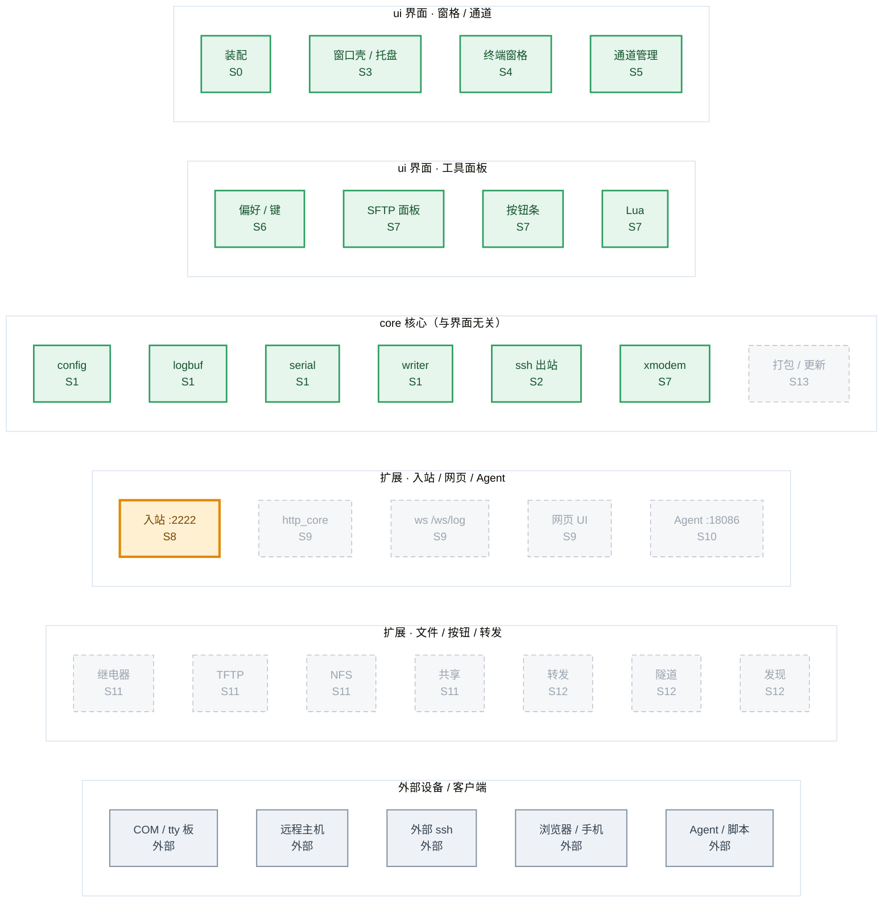
```mermaid
%%{init: {'theme':'base','themeVariables':{'clusterBkg':'#ffffff','clusterBorder':'#d7e1ec','fontFamily':'Microsoft YaHei, sans-serif','fontSize':'14px','lineColor':'#8794a3'},'flowchart':{'htmlLabels':false,'useMaxWidth':true}}}%%
flowchart LR
  classDef ext fill:#eef2f7,stroke:#8794a3,stroke-width:1.5px,color:#33414f
  classDef done fill:#e6f6ec,stroke:#2f9e63,stroke-width:2px,color:#14532d
  classDef cur fill:#fff0d2,stroke:#e08900,stroke-width:3px,color:#7a4400
  classDef plan fill:#f6f7f9,stroke:#b9c0c9,stroke-width:1px,color:#9aa4af,stroke-dasharray:6 4
  subgraph OUT["外部设备 / 客户端"]
    direction TB
    E_COM["COM / tty 板<br/>外部"]:::ext
    E_HOST["远程主机<br/>外部"]:::ext
    E_CLI["外部 ssh<br/>外部"]:::ext
    E_BR["浏览器 / 手机<br/>外部"]:::ext
    E_AG["Agent / 脚本<br/>外部"]:::ext
  end
  subgraph GSVC2["扩展 · 文件 / 按钮 / 转发"]
    direction TB
    REL["继电器<br/>S11"]:::plan
    TFTP["TFTP<br/>S11"]:::plan
    NFS["NFS<br/>S11"]:::plan
    SHR["共享<br/>S11"]:::plan
    FWD["转发<br/>S12"]:::plan
    TUN["隧道<br/>S12"]:::plan
    DSC["发现<br/>S12"]:::plan
  end
  subgraph GSVC1["扩展 · 入站 / 网页 / Agent"]
    direction TB
    INB["入站 :2222<br/>S8"]:::cur
    HTTP["http_core<br/>S9"]:::plan
    WS["ws /ws/log<br/>S9"]:::plan
    WEB["网页 UI<br/>S9"]:::plan
    AGT["Agent :18086<br/>S10"]:::plan
  end
  subgraph GCORE["core 核心（与界面无关）"]
    direction TB
    CFG["config<br/>S1"]:::done
    LOGB["logbuf<br/>S1"]:::done
    SER["serial<br/>S1"]:::done
    WR["writer<br/>S1"]:::done
    SSHOB["ssh 出站<br/>S2"]:::done
    XMOD["xmodem<br/>S7"]:::done
    UPD["打包 / 更新<br/>S13"]:::plan
  end
  subgraph GUI2["ui 界面 · 工具面板"]
    direction TB
    PREFS["偏好 / 键<br/>S6"]:::done
    SFTP["SFTP 面板<br/>S7"]:::done
    BTN["按钮条<br/>S7"]:::done
    LUA["Lua<br/>S7"]:::done
  end
  subgraph GUI1["ui 界面 · 窗格 / 通道"]
    direction TB
    APP["装配<br/>S0"]:::done
    SHELL["窗口壳 / 托盘<br/>S3"]:::done
    TERM["终端窗格<br/>S4"]:::done
    MGMT["通道管理<br/>S5"]:::done
  end
```

## S9 HTTP 基元 + 网页端

本步新增：**http_core、ws /ws/log、网页 UI　｜　累计落地 18 / 27 个模块**

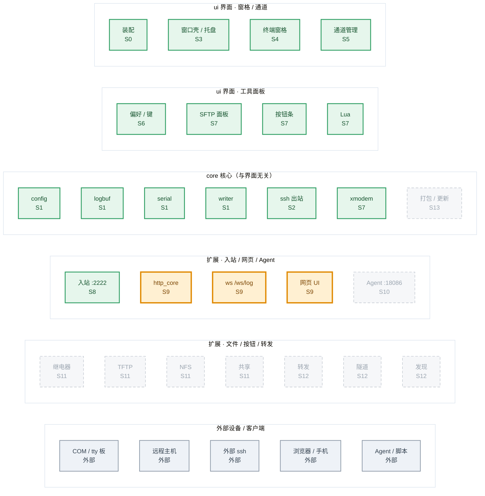
```mermaid
%%{init: {'theme':'base','themeVariables':{'clusterBkg':'#ffffff','clusterBorder':'#d7e1ec','fontFamily':'Microsoft YaHei, sans-serif','fontSize':'14px','lineColor':'#8794a3'},'flowchart':{'htmlLabels':false,'useMaxWidth':true}}}%%
flowchart LR
  classDef ext fill:#eef2f7,stroke:#8794a3,stroke-width:1.5px,color:#33414f
  classDef done fill:#e6f6ec,stroke:#2f9e63,stroke-width:2px,color:#14532d
  classDef cur fill:#fff0d2,stroke:#e08900,stroke-width:3px,color:#7a4400
  classDef plan fill:#f6f7f9,stroke:#b9c0c9,stroke-width:1px,color:#9aa4af,stroke-dasharray:6 4
  subgraph OUT["外部设备 / 客户端"]
    direction TB
    E_COM["COM / tty 板<br/>外部"]:::ext
    E_HOST["远程主机<br/>外部"]:::ext
    E_CLI["外部 ssh<br/>外部"]:::ext
    E_BR["浏览器 / 手机<br/>外部"]:::ext
    E_AG["Agent / 脚本<br/>外部"]:::ext
  end
  subgraph GSVC2["扩展 · 文件 / 按钮 / 转发"]
    direction TB
    REL["继电器<br/>S11"]:::plan
    TFTP["TFTP<br/>S11"]:::plan
    NFS["NFS<br/>S11"]:::plan
    SHR["共享<br/>S11"]:::plan
    FWD["转发<br/>S12"]:::plan
    TUN["隧道<br/>S12"]:::plan
    DSC["发现<br/>S12"]:::plan
  end
  subgraph GSVC1["扩展 · 入站 / 网页 / Agent"]
    direction TB
    INB["入站 :2222<br/>S8"]:::done
    HTTP["http_core<br/>S9"]:::cur
    WS["ws /ws/log<br/>S9"]:::cur
    WEB["网页 UI<br/>S9"]:::cur
    AGT["Agent :18086<br/>S10"]:::plan
  end
  subgraph GCORE["core 核心（与界面无关）"]
    direction TB
    CFG["config<br/>S1"]:::done
    LOGB["logbuf<br/>S1"]:::done
    SER["serial<br/>S1"]:::done
    WR["writer<br/>S1"]:::done
    SSHOB["ssh 出站<br/>S2"]:::done
    XMOD["xmodem<br/>S7"]:::done
    UPD["打包 / 更新<br/>S13"]:::plan
  end
  subgraph GUI2["ui 界面 · 工具面板"]
    direction TB
    PREFS["偏好 / 键<br/>S6"]:::done
    SFTP["SFTP 面板<br/>S7"]:::done
    BTN["按钮条<br/>S7"]:::done
    LUA["Lua<br/>S7"]:::done
  end
  subgraph GUI1["ui 界面 · 窗格 / 通道"]
    direction TB
    APP["装配<br/>S0"]:::done
    SHELL["窗口壳 / 托盘<br/>S3"]:::done
    TERM["终端窗格<br/>S4"]:::done
    MGMT["通道管理<br/>S5"]:::done
  end
```

## S10 Agent 接口

本步新增：**Agent :18086　｜　累计落地 19 / 27 个模块**

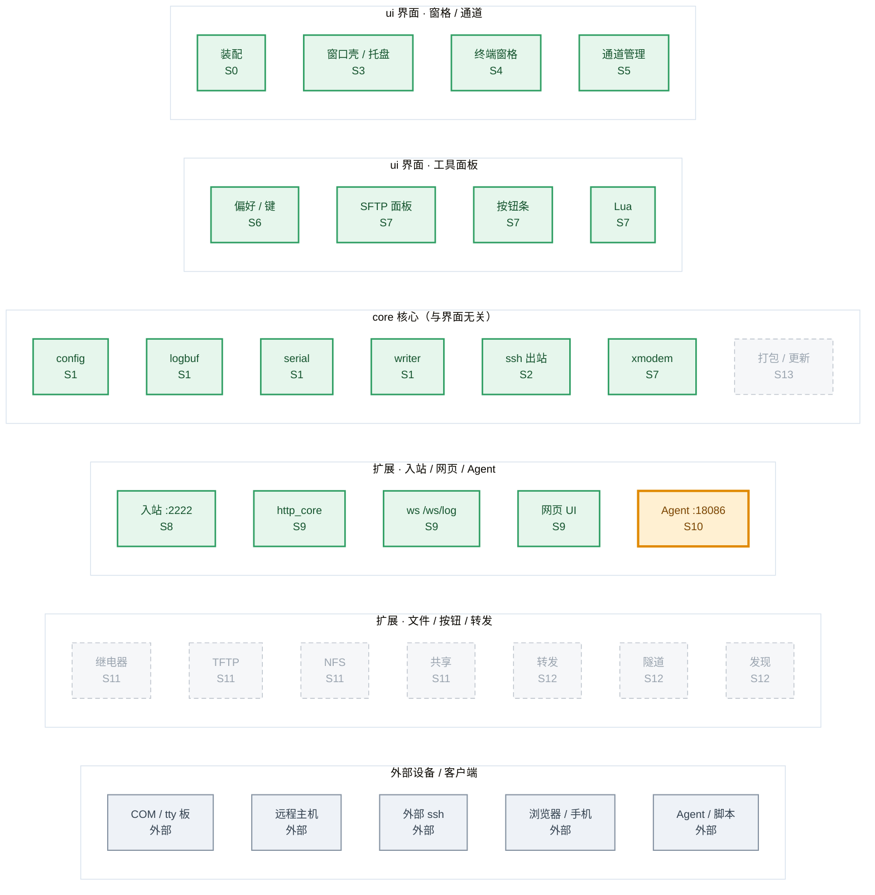
```mermaid
%%{init: {'theme':'base','themeVariables':{'clusterBkg':'#ffffff','clusterBorder':'#d7e1ec','fontFamily':'Microsoft YaHei, sans-serif','fontSize':'14px','lineColor':'#8794a3'},'flowchart':{'htmlLabels':false,'useMaxWidth':true}}}%%
flowchart LR
  classDef ext fill:#eef2f7,stroke:#8794a3,stroke-width:1.5px,color:#33414f
  classDef done fill:#e6f6ec,stroke:#2f9e63,stroke-width:2px,color:#14532d
  classDef cur fill:#fff0d2,stroke:#e08900,stroke-width:3px,color:#7a4400
  classDef plan fill:#f6f7f9,stroke:#b9c0c9,stroke-width:1px,color:#9aa4af,stroke-dasharray:6 4
  subgraph OUT["外部设备 / 客户端"]
    direction TB
    E_COM["COM / tty 板<br/>外部"]:::ext
    E_HOST["远程主机<br/>外部"]:::ext
    E_CLI["外部 ssh<br/>外部"]:::ext
    E_BR["浏览器 / 手机<br/>外部"]:::ext
    E_AG["Agent / 脚本<br/>外部"]:::ext
  end
  subgraph GSVC2["扩展 · 文件 / 按钮 / 转发"]
    direction TB
    REL["继电器<br/>S11"]:::plan
    TFTP["TFTP<br/>S11"]:::plan
    NFS["NFS<br/>S11"]:::plan
    SHR["共享<br/>S11"]:::plan
    FWD["转发<br/>S12"]:::plan
    TUN["隧道<br/>S12"]:::plan
    DSC["发现<br/>S12"]:::plan
  end
  subgraph GSVC1["扩展 · 入站 / 网页 / Agent"]
    direction TB
    INB["入站 :2222<br/>S8"]:::done
    HTTP["http_core<br/>S9"]:::done
    WS["ws /ws/log<br/>S9"]:::done
    WEB["网页 UI<br/>S9"]:::done
    AGT["Agent :18086<br/>S10"]:::cur
  end
  subgraph GCORE["core 核心（与界面无关）"]
    direction TB
    CFG["config<br/>S1"]:::done
    LOGB["logbuf<br/>S1"]:::done
    SER["serial<br/>S1"]:::done
    WR["writer<br/>S1"]:::done
    SSHOB["ssh 出站<br/>S2"]:::done
    XMOD["xmodem<br/>S7"]:::done
    UPD["打包 / 更新<br/>S13"]:::plan
  end
  subgraph GUI2["ui 界面 · 工具面板"]
    direction TB
    PREFS["偏好 / 键<br/>S6"]:::done
    SFTP["SFTP 面板<br/>S7"]:::done
    BTN["按钮条<br/>S7"]:::done
    LUA["Lua<br/>S7"]:::done
  end
  subgraph GUI1["ui 界面 · 窗格 / 通道"]
    direction TB
    APP["装配<br/>S0"]:::done
    SHELL["窗口壳 / 托盘<br/>S3"]:::done
    TERM["终端窗格<br/>S4"]:::done
    MGMT["通道管理<br/>S5"]:::done
  end
```

## S11 继电器 / TFTP / NFS

本步新增：**继电器、TFTP、NFS、共享　｜　累计落地 23 / 27 个模块**

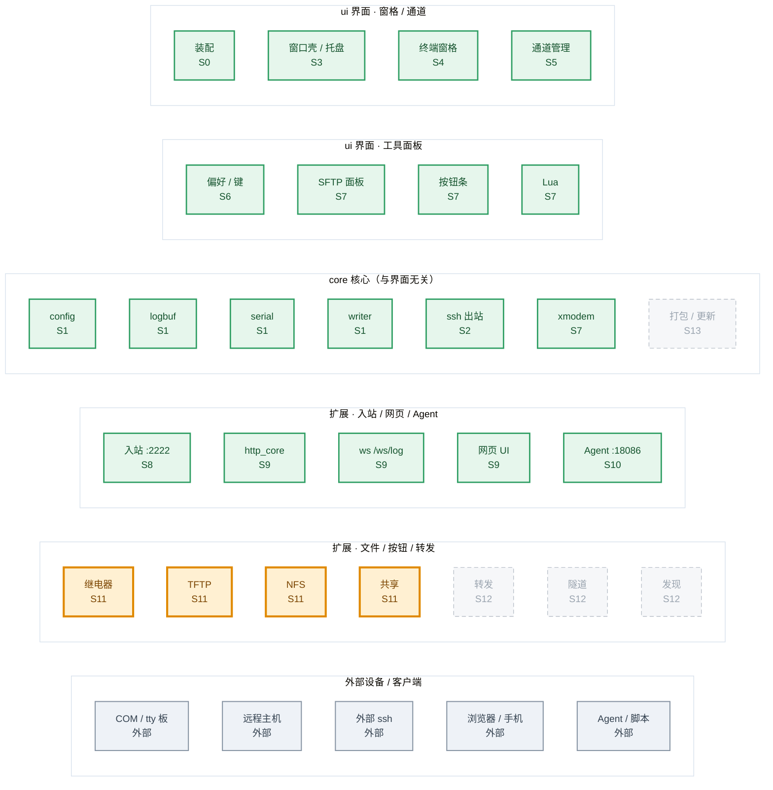
```mermaid
%%{init: {'theme':'base','themeVariables':{'clusterBkg':'#ffffff','clusterBorder':'#d7e1ec','fontFamily':'Microsoft YaHei, sans-serif','fontSize':'14px','lineColor':'#8794a3'},'flowchart':{'htmlLabels':false,'useMaxWidth':true}}}%%
flowchart LR
  classDef ext fill:#eef2f7,stroke:#8794a3,stroke-width:1.5px,color:#33414f
  classDef done fill:#e6f6ec,stroke:#2f9e63,stroke-width:2px,color:#14532d
  classDef cur fill:#fff0d2,stroke:#e08900,stroke-width:3px,color:#7a4400
  classDef plan fill:#f6f7f9,stroke:#b9c0c9,stroke-width:1px,color:#9aa4af,stroke-dasharray:6 4
  subgraph OUT["外部设备 / 客户端"]
    direction TB
    E_COM["COM / tty 板<br/>外部"]:::ext
    E_HOST["远程主机<br/>外部"]:::ext
    E_CLI["外部 ssh<br/>外部"]:::ext
    E_BR["浏览器 / 手机<br/>外部"]:::ext
    E_AG["Agent / 脚本<br/>外部"]:::ext
  end
  subgraph GSVC2["扩展 · 文件 / 按钮 / 转发"]
    direction TB
    REL["继电器<br/>S11"]:::cur
    TFTP["TFTP<br/>S11"]:::cur
    NFS["NFS<br/>S11"]:::cur
    SHR["共享<br/>S11"]:::cur
    FWD["转发<br/>S12"]:::plan
    TUN["隧道<br/>S12"]:::plan
    DSC["发现<br/>S12"]:::plan
  end
  subgraph GSVC1["扩展 · 入站 / 网页 / Agent"]
    direction TB
    INB["入站 :2222<br/>S8"]:::done
    HTTP["http_core<br/>S9"]:::done
    WS["ws /ws/log<br/>S9"]:::done
    WEB["网页 UI<br/>S9"]:::done
    AGT["Agent :18086<br/>S10"]:::done
  end
  subgraph GCORE["core 核心（与界面无关）"]
    direction TB
    CFG["config<br/>S1"]:::done
    LOGB["logbuf<br/>S1"]:::done
    SER["serial<br/>S1"]:::done
    WR["writer<br/>S1"]:::done
    SSHOB["ssh 出站<br/>S2"]:::done
    XMOD["xmodem<br/>S7"]:::done
    UPD["打包 / 更新<br/>S13"]:::plan
  end
  subgraph GUI2["ui 界面 · 工具面板"]
    direction TB
    PREFS["偏好 / 键<br/>S6"]:::done
    SFTP["SFTP 面板<br/>S7"]:::done
    BTN["按钮条<br/>S7"]:::done
    LUA["Lua<br/>S7"]:::done
  end
  subgraph GUI1["ui 界面 · 窗格 / 通道"]
    direction TB
    APP["装配<br/>S0"]:::done
    SHELL["窗口壳 / 托盘<br/>S3"]:::done
    TERM["终端窗格<br/>S4"]:::done
    MGMT["通道管理<br/>S5"]:::done
  end
```

## S12 TCP 转发 / 隧道 / 发现

本步新增：**转发、隧道、发现　｜　累计落地 26 / 27 个模块**

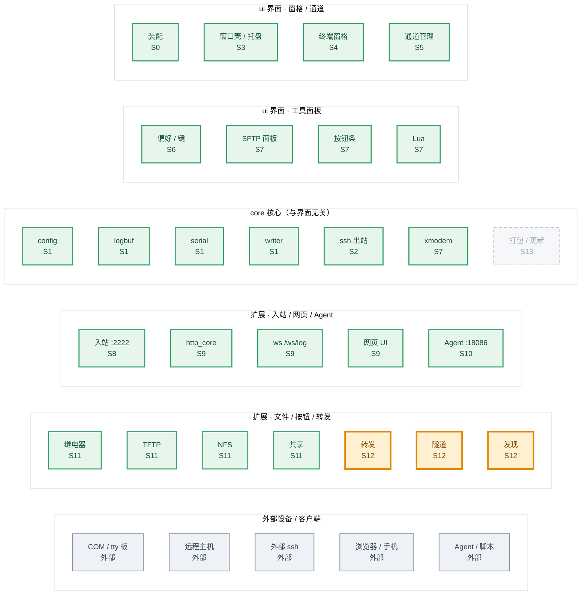
```mermaid
%%{init: {'theme':'base','themeVariables':{'clusterBkg':'#ffffff','clusterBorder':'#d7e1ec','fontFamily':'Microsoft YaHei, sans-serif','fontSize':'14px','lineColor':'#8794a3'},'flowchart':{'htmlLabels':false,'useMaxWidth':true}}}%%
flowchart LR
  classDef ext fill:#eef2f7,stroke:#8794a3,stroke-width:1.5px,color:#33414f
  classDef done fill:#e6f6ec,stroke:#2f9e63,stroke-width:2px,color:#14532d
  classDef cur fill:#fff0d2,stroke:#e08900,stroke-width:3px,color:#7a4400
  classDef plan fill:#f6f7f9,stroke:#b9c0c9,stroke-width:1px,color:#9aa4af,stroke-dasharray:6 4
  subgraph OUT["外部设备 / 客户端"]
    direction TB
    E_COM["COM / tty 板<br/>外部"]:::ext
    E_HOST["远程主机<br/>外部"]:::ext
    E_CLI["外部 ssh<br/>外部"]:::ext
    E_BR["浏览器 / 手机<br/>外部"]:::ext
    E_AG["Agent / 脚本<br/>外部"]:::ext
  end
  subgraph GSVC2["扩展 · 文件 / 按钮 / 转发"]
    direction TB
    REL["继电器<br/>S11"]:::done
    TFTP["TFTP<br/>S11"]:::done
    NFS["NFS<br/>S11"]:::done
    SHR["共享<br/>S11"]:::done
    FWD["转发<br/>S12"]:::cur
    TUN["隧道<br/>S12"]:::cur
    DSC["发现<br/>S12"]:::cur
  end
  subgraph GSVC1["扩展 · 入站 / 网页 / Agent"]
    direction TB
    INB["入站 :2222<br/>S8"]:::done
    HTTP["http_core<br/>S9"]:::done
    WS["ws /ws/log<br/>S9"]:::done
    WEB["网页 UI<br/>S9"]:::done
    AGT["Agent :18086<br/>S10"]:::done
  end
  subgraph GCORE["core 核心（与界面无关）"]
    direction TB
    CFG["config<br/>S1"]:::done
    LOGB["logbuf<br/>S1"]:::done
    SER["serial<br/>S1"]:::done
    WR["writer<br/>S1"]:::done
    SSHOB["ssh 出站<br/>S2"]:::done
    XMOD["xmodem<br/>S7"]:::done
    UPD["打包 / 更新<br/>S13"]:::plan
  end
  subgraph GUI2["ui 界面 · 工具面板"]
    direction TB
    PREFS["偏好 / 键<br/>S6"]:::done
    SFTP["SFTP 面板<br/>S7"]:::done
    BTN["按钮条<br/>S7"]:::done
    LUA["Lua<br/>S7"]:::done
  end
  subgraph GUI1["ui 界面 · 窗格 / 通道"]
    direction TB
    APP["装配<br/>S0"]:::done
    SHELL["窗口壳 / 托盘<br/>S3"]:::done
    TERM["终端窗格<br/>S4"]:::done
    MGMT["通道管理<br/>S5"]:::done
  end
```

## S13 自更新 / 打包 / 全量回归

本步新增：**打包 / 更新　｜　累计落地 27 / 27 个模块**

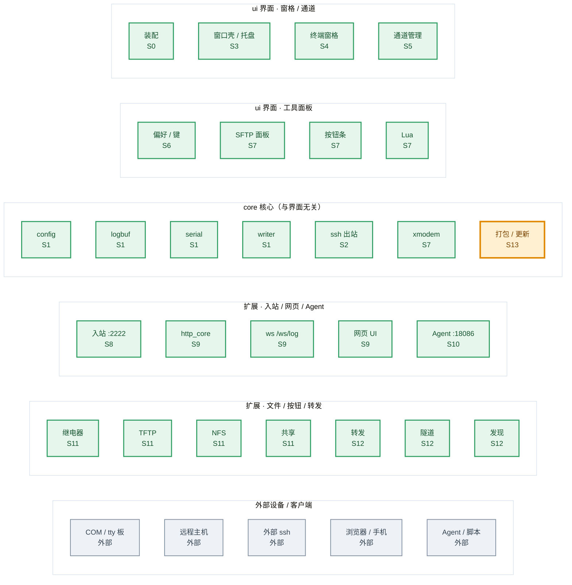
```mermaid
%%{init: {'theme':'base','themeVariables':{'clusterBkg':'#ffffff','clusterBorder':'#d7e1ec','fontFamily':'Microsoft YaHei, sans-serif','fontSize':'14px','lineColor':'#8794a3'},'flowchart':{'htmlLabels':false,'useMaxWidth':true}}}%%
flowchart LR
  classDef ext fill:#eef2f7,stroke:#8794a3,stroke-width:1.5px,color:#33414f
  classDef done fill:#e6f6ec,stroke:#2f9e63,stroke-width:2px,color:#14532d
  classDef cur fill:#fff0d2,stroke:#e08900,stroke-width:3px,color:#7a4400
  classDef plan fill:#f6f7f9,stroke:#b9c0c9,stroke-width:1px,color:#9aa4af,stroke-dasharray:6 4
  subgraph OUT["外部设备 / 客户端"]
    direction TB
    E_COM["COM / tty 板<br/>外部"]:::ext
    E_HOST["远程主机<br/>外部"]:::ext
    E_CLI["外部 ssh<br/>外部"]:::ext
    E_BR["浏览器 / 手机<br/>外部"]:::ext
    E_AG["Agent / 脚本<br/>外部"]:::ext
  end
  subgraph GSVC2["扩展 · 文件 / 按钮 / 转发"]
    direction TB
    REL["继电器<br/>S11"]:::done
    TFTP["TFTP<br/>S11"]:::done
    NFS["NFS<br/>S11"]:::done
    SHR["共享<br/>S11"]:::done
    FWD["转发<br/>S12"]:::done
    TUN["隧道<br/>S12"]:::done
    DSC["发现<br/>S12"]:::done
  end
  subgraph GSVC1["扩展 · 入站 / 网页 / Agent"]
    direction TB
    INB["入站 :2222<br/>S8"]:::done
    HTTP["http_core<br/>S9"]:::done
    WS["ws /ws/log<br/>S9"]:::done
    WEB["网页 UI<br/>S9"]:::done
    AGT["Agent :18086<br/>S10"]:::done
  end
  subgraph GCORE["core 核心（与界面无关）"]
    direction TB
    CFG["config<br/>S1"]:::done
    LOGB["logbuf<br/>S1"]:::done
    SER["serial<br/>S1"]:::done
    WR["writer<br/>S1"]:::done
    SSHOB["ssh 出站<br/>S2"]:::done
    XMOD["xmodem<br/>S7"]:::done
    UPD["打包 / 更新<br/>S13"]:::cur
  end
  subgraph GUI2["ui 界面 · 工具面板"]
    direction TB
    PREFS["偏好 / 键<br/>S6"]:::done
    SFTP["SFTP 面板<br/>S7"]:::done
    BTN["按钮条<br/>S7"]:::done
    LUA["Lua<br/>S7"]:::done
  end
  subgraph GUI1["ui 界面 · 窗格 / 通道"]
    direction TB
    APP["装配<br/>S0"]:::done
    SHELL["窗口壳 / 托盘<br/>S3"]:::done
    TERM["终端窗格<br/>S4"]:::done
    MGMT["通道管理<br/>S5"]:::done
  end
```
